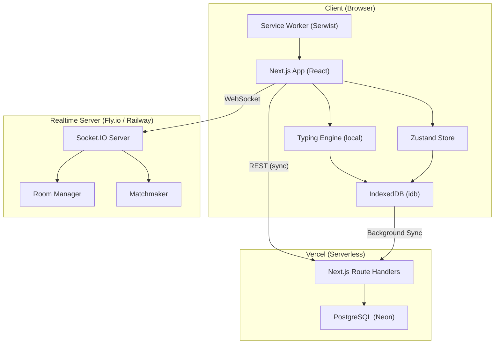
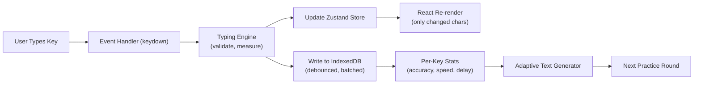
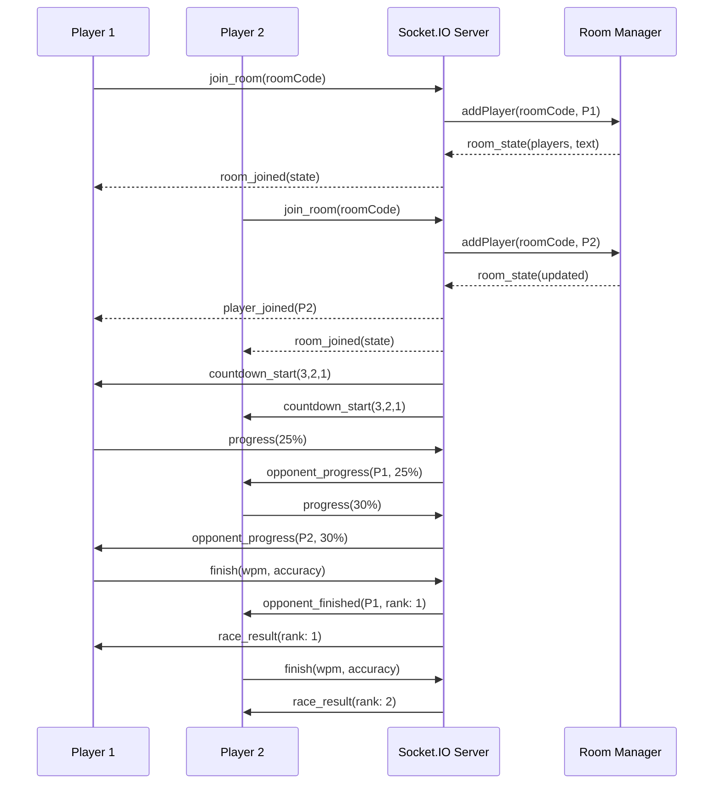
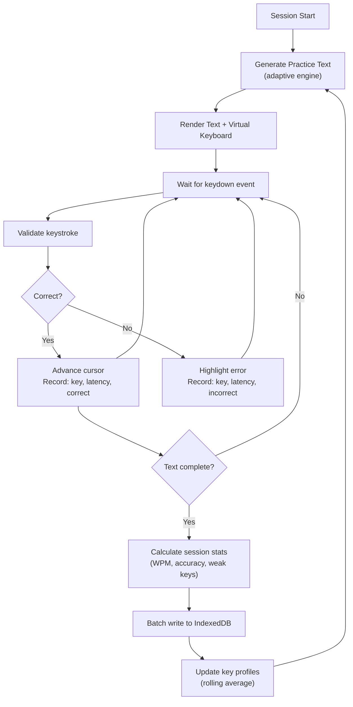
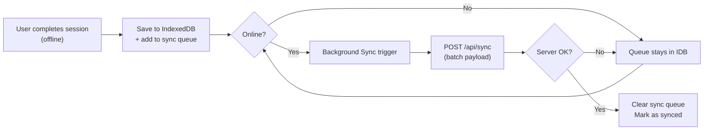
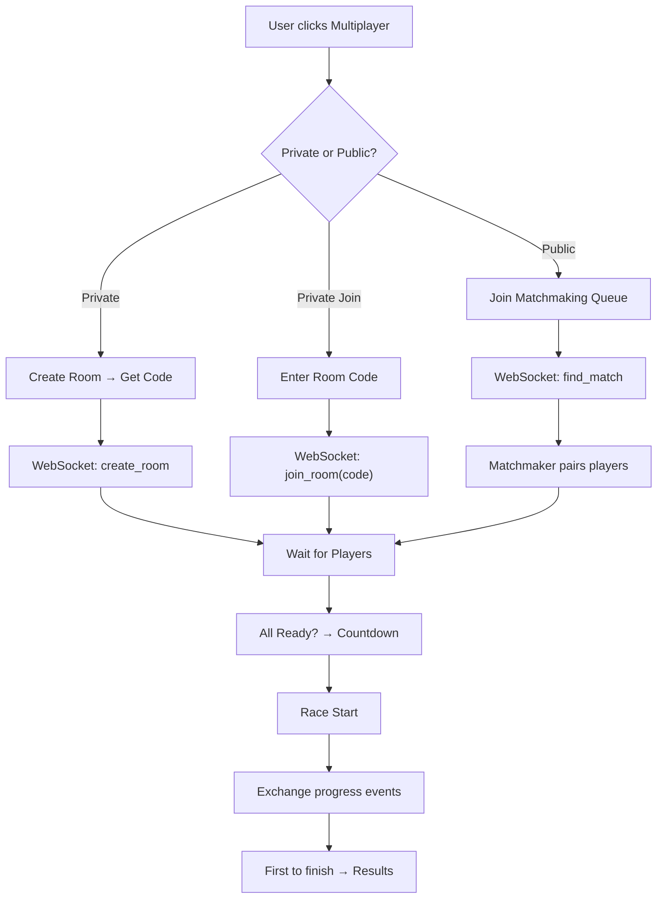
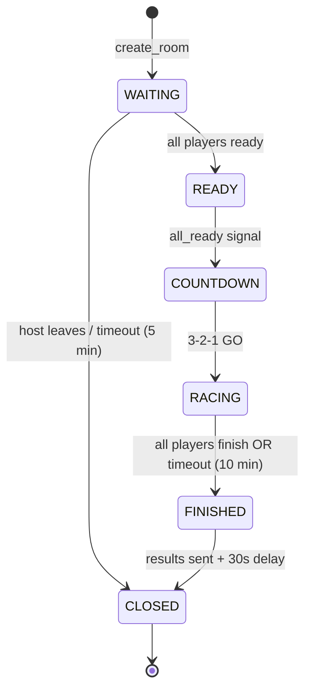
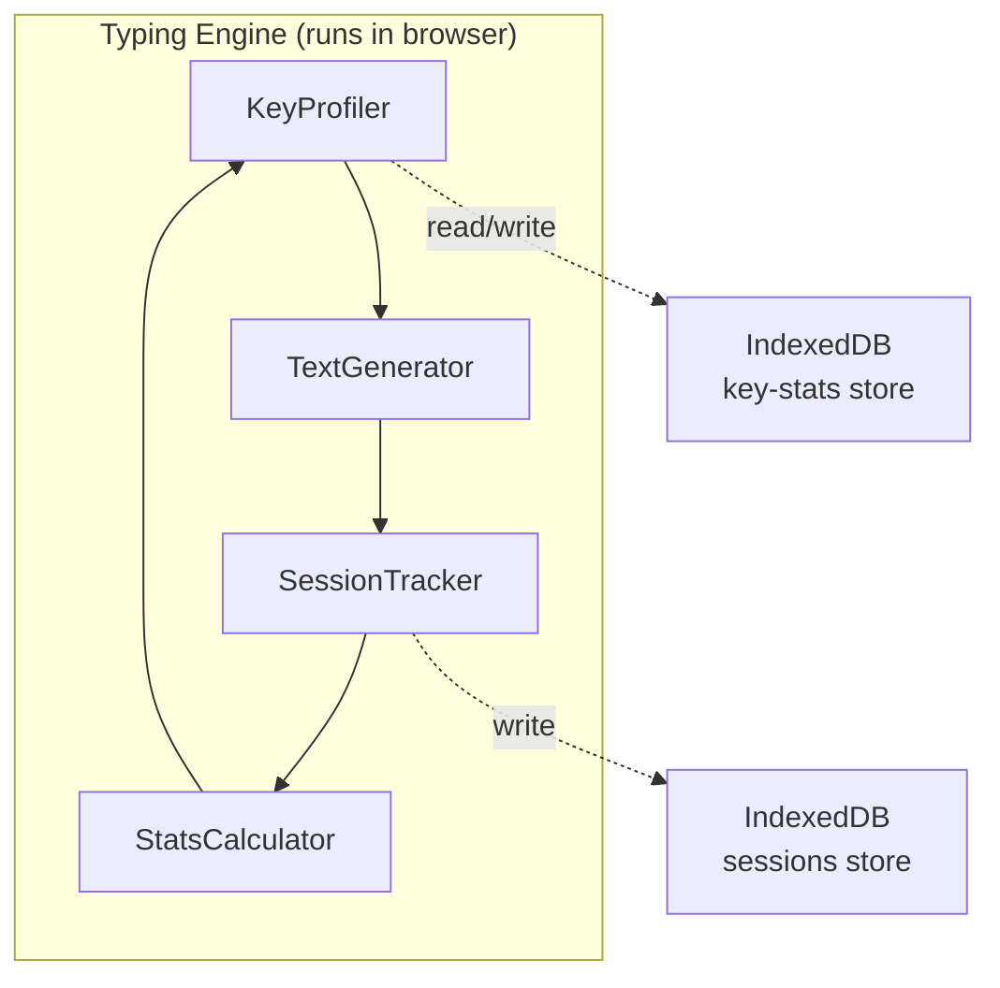

# VaagaTypePanalam — Full System Architecture & Implementation Plan

> *A minimal, high-performance, offline-first typing practice PWA for English, Tamil (Unicode), and Tanglish.*

---

## Table of Contents

1. [System Overview](#1-system-overview)
2. [Full System Architecture](#2-full-system-architecture)
3. [Data Flow Diagrams](#3-data-flow-diagrams)
4. [IndexedDB Schema](#4-indexeddb-schema)
5. [WebSocket Event Design](#5-websocket-event-design)
6. [Room Management Logic](#6-room-management-logic)
7. [Matchmaking Algorithm](#7-matchmaking-algorithm)
8. [Typing Engine Algorithm](#8-typing-engine-algorithm)
9. [Performance Strategies](#9-performance-strategies)
10. [Mobile Optimization Strategy](#10-mobile-optimization-strategy)
11. [Beginner Learning Path](#11-beginner-learning-path)
12. [Folder Structure](#12-folder-structure)
13. [Reference Sites Analysis](#13-reference-sites-analysis)
14. [Verification Plan](#14-verification-plan)

---

## 1. System Overview

### 1.1 What is VaagaTypePanalam?

**VaagaTypePanalam** ("வாகை டைப் பணாலம்") is a beginner-friendly, adaptive typing practice web app. It teaches touch typing from scratch, tracks per-key performance, and generates targeted practice text — all running **offline-first** in the browser.

### 1.2 Core Principles

| Principle | Implementation |
|---|---|
| **Offline-First** | Typing engine runs 100% client-side. IndexedDB stores all state. Service Worker caches the app shell. |
| **Minimal Resources** | Event-driven architecture. Zero polling. No `setInterval` loops. requestAnimationFrame only when visible. |
| **Beginner-Friendly** | Progressive lesson plan. Start with home row → expand gradually. Visual keyboard guide. |
| **Multi-Language** | English (QWERTY), Tamil (Tamil99 layout, Unicode), Tanglish (transliteration) |
| **Multiplayer** | Real-time typing races via Socket.IO. Private rooms + public matchmaking. |

### 1.3 Tech Stack

| Layer | Technology | Why |
|---|---|---|
| **Frontend** | Next.js 15 (App Router) | SSG for speed, React Server Components, deployed on Vercel |
| **PWA** | `@serwist/next` | Modern Workbox fork with App Router support |
| **IndexedDB** | `idb` library | Promise-based wrapper, tiny footprint |
| **State** | Zustand | Minimal, event-driven, no re-render storms |
| **Styling** | Vanilla CSS (custom properties) | Zero runtime overhead, full control |
| **Fonts** | Google Fonts — Inter + Noto Sans Tamil | Clean, multi-script support |
| **Realtime** | Socket.IO (standalone Node.js server) | Built-in rooms, reconnection, fallback transport |
| **Backend APIs** | Next.js Route Handlers (Vercel serverless) | Sync profiles, leaderboards |
| **Database (server)** | PostgreSQL (Neon/Supabase) | Serverless Postgres, free tier friendly |
| **ORM** | Prisma | Type-safe, migrations, works with serverless |

---

## 2. Full System Architecture

### 2.1 High-Level Architecture Diagram



### 2.2 Solo Mode Architecture



### 2.3 Multiplayer Architecture



---

## 3. Data Flow Diagrams

### 3.1 Solo Typing Session Flow



### 3.2 Offline → Online Sync Flow



### 3.3 Multiplayer Connection Flow



---

## 4. IndexedDB Schema

### 4.1 Database: `vaaga-typing-db` (version 1)

```typescript
// Using 'idb' library for Promise-based access

interface VaagaDB extends DBSchema {
  
  // ── Store 1: User Profile ──
  'user-profile': {
    key: string;               // 'default' (single user)
    value: {
      id: string;
      displayName: string;
      language: 'en' | 'ta' | 'tanglish';
      keyboardLayout: 'qwerty' | 'tamil99' | 'phonetic';
      theme: 'dark' | 'light';
      createdAt: number;       // Unix timestamp
      lastSessionAt: number;
      totalSessions: number;
      totalTimeMs: number;
      bestWpm: number;
      currentLevel: number;    // Beginner progression level (1-30)
      unlockedKeys: string[];  // Keys unlocked so far
    };
  };
  
  // ── Store 2: Per-Key Statistics ──
  'key-stats': {
    key: string;                // The character, e.g. 'a', 'க', etc.
    value: {
      char: string;
      language: 'en' | 'ta' | 'tanglish';
      totalAttempts: number;
      correctAttempts: number;
      accuracy: number;         // 0-1 (rolling avg, last 50)
      avgLatencyMs: number;     // Rolling average response time
      recentLatencies: number[];// Last 20 latencies (circular buffer)
      recentCorrect: boolean[]; // Last 50 results (circular buffer)
      lastPracticed: number;    // Unix timestamp
      isWeak: boolean;          // Derived: accuracy < 0.85 || avgLatencyMs > 800
      confidence: number;       // 0-1 score combining accuracy + speed
    };
    indexes: {
      'by-language': string;
      'by-confidence': number;
      'by-weak': boolean;
    };
  };

  // ── Store 3: Session History ──
  'sessions': {
    key: string;               // UUID
    value: {
      id: string;
      language: 'en' | 'ta' | 'tanglish';
      mode: 'practice' | 'test' | 'race';
      startedAt: number;
      endedAt: number;
      durationMs: number;
      wpm: number;
      rawWpm: number;
      accuracy: number;
      totalChars: number;
      correctChars: number;
      errorChars: number;
      text: string;
      keystrokeLog: {          // Compact log
        char: string;
        correct: boolean;
        latencyMs: number;
      }[];
      synced: boolean;         // Has this been sent to server?
      level: number;           // Which beginner level
    };
    indexes: {
      'by-date': number;
      'by-synced': boolean;
      'by-language': string;
    };
  };

  // ── Store 4: Sync Queue ──
  'sync-queue': {
    key: number;               // Auto-increment
    value: {
      type: 'session' | 'profile' | 'key-stats';
      payload: unknown;
      createdAt: number;
      retryCount: number;
    };
  };

  // ── Store 5: Lesson Progress ──
  'lesson-progress': {
    key: string;               // lesson ID, e.g. "en-lesson-3"
    value: {
      lessonId: string;
      language: 'en' | 'ta' | 'tanglish';
      level: number;
      completed: boolean;
      bestWpm: number;
      bestAccuracy: number;
      attempts: number;
      lastAttemptAt: number;
    };
    indexes: {
      'by-language': string;
      'by-level': number;
    };
  };
}
```

### 4.2 Schema Size Estimates

| Store | Avg Record Size | Max Records (1 year) | Total Size |
|---|---|---|---|
| user-profile | 500 B | 1 | ~500 B |
| key-stats | 400 B | ~200 keys | ~80 KB |
| sessions | 5 KB (without full log) | ~1,000 | ~5 MB |
| sync-queue | 200 B | ~50 (transient) | ~10 KB |
| lesson-progress | 200 B | ~90 | ~18 KB |
| **Total** | | | **~5.1 MB** |

> [!TIP]
> Total storage stays well under the 50MB browser limit. Keystroke logs for old sessions can be pruned after sync to keep size minimal.

---

## 5. WebSocket Event Design

### 5.1 Client → Server Events

| Event | Payload | When |
|---|---|---|
| `create_room` | `{ playerId, displayName, language, maxPlayers? }` | Player creates a private room |
| `join_room` | `{ roomCode, playerId, displayName }` | Player joins via room code |
| `find_match` | `{ playerId, displayName, language, skillLevel? }` | Player enters public queue |
| `cancel_match` | `{ playerId }` | Player cancels matchmaking |
| `player_ready` | `{ roomCode, playerId }` | Player signals ready |
| `progress` | `{ roomCode, playerId, percent, wpm }` | Every 5% progress or every 2 seconds (throttled) |
| `finish` | `{ roomCode, playerId, wpm, accuracy, timeMs }` | Player completes the text |
| `leave_room` | `{ roomCode, playerId }` | Player leaves voluntarily |

### 5.2 Server → Client Events

| Event | Payload | When |
|---|---|---|
| `room_created` | `{ roomCode, text, settings }` | Room successfully created |
| `room_joined` | `{ roomCode, players[], text, settings }` | Player successfully joined |
| `player_joined` | `{ playerId, displayName }` | New player entered room |
| `player_left` | `{ playerId }` | Player disconnected/left |
| `match_found` | `{ roomCode, players[], text }` | Matchmaker found opponent(s) |
| `all_ready` | `{ countdown: 3 }` | All players ready |
| `race_start` | `{ startTime }` | GO signal (server timestamp) |
| `opponent_progress` | `{ playerId, percent, wpm }` | Other player's progress |
| `opponent_finished` | `{ playerId, rank, wpm, accuracy }` | Other player completed |
| `race_result` | `{ rankings: [{playerId, rank, wpm, accuracy, timeMs}] }` | Final standings |
| `room_closed` | `{ reason }` | Room expired or host left |
| `error` | `{ code, message }` | Validation errors |

### 5.3 Payload Optimization

```typescript
// BLOATED — Don't do this:
{ playerId: "uuid-here", roomCode: "ABC123", currentCharIndex: 247, totalChars: 500, wpm: 65.3, accuracy: 0.972 }

// OPTIMIZED — Do this (24 bytes vs 120+ bytes):
{ p: 49, w: 65 }
// p = percent (0-100, uint8)
// w = wpm (uint16)
// roomCode inferred from socket's current room
// playerId inferred from socket.id mapping
```

> [!IMPORTANT]
> Progress events are the highest-frequency events. Every byte matters.
> - Send only `percent` (0-100) and `wpm` (integer)
> - Server maps `socket.id → playerId` internally
> - Room is tracked by the socket object via `socket.rooms`

---

## 6. Room Management Logic

### 6.1 Room Lifecycle



### 6.2 Server-Side Room State

```typescript
interface Room {
  code: string;                // 6-char alphanumeric (e.g. "VK8M2P")
  type: 'private' | 'public';
  language: 'en' | 'ta' | 'tanglish';
  text: string;                // The race text
  maxPlayers: number;          // Default: 4
  state: 'waiting' | 'countdown' | 'racing' | 'finished';
  
  players: Map<string, {       // socketId → PlayerState
    id: string;
    displayName: string;
    ready: boolean;
    progress: number;          // 0-100
    wpm: number;
    finishedAt: number | null;
    rank: number | null;
  }>;
  
  createdAt: number;
  startedAt: number | null;
  expiresAt: number;           // Auto-cleanup timestamp
}
```

### 6.3 Room Code Generation

```typescript
function generateRoomCode(): string {
  // 6-char uppercase alphanumeric (excludes confusable chars: 0/O, 1/I/L)
  const chars = 'ABCDEFGHJKMNPQRSTUVWXYZ23456789';
  let code = '';
  const array = new Uint8Array(6);
  crypto.getRandomValues(array);
  for (const byte of array) {
    code += chars[byte % chars.length];
  }
  return code;
}
// Collision check: 30^6 = 729 million possibilities → negligible collision risk
```

### 6.4 Room Cleanup Strategy

```typescript
// Runs every 60 seconds (setInterval on server — acceptable for server, not client)
function cleanupRooms(rooms: Map<string, Room>) {
  const now = Date.now();
  for (const [code, room] of rooms) {
    if (now > room.expiresAt) {
      // Notify remaining players
      io.to(code).emit('room_closed', { reason: 'timeout' });
      // Remove all sockets from the Socket.IO room
      io.in(code).socketsLeave(code);
      rooms.delete(code);
    }
  }
}
```

### 6.5 Expiry Rules

| State | Timeout | Reason |
|---|---|---|
| `waiting` | 5 minutes | Room idle, no one joined |
| `countdown` | 10 seconds | (built-in, not a timeout) |
| `racing` | 10 minutes | Safety net for abandoned races |
| `finished` | 30 seconds | Keep results visible, then clean up |

---

## 7. Matchmaking Algorithm

### 7.1 Overview

Public matchmaking uses a **queue-based, skill-bucketed** system. Simple, fast, no over-engineering.

### 7.2 Matchmaking Queue

```typescript
interface QueueEntry {
  socketId: string;
  playerId: string;
  displayName: string;
  language: 'en' | 'ta' | 'tanglish';
  skillLevel: 'beginner' | 'intermediate' | 'advanced';
  joinedAt: number;
}

// Separate queues per language × skill level
const queues: Map<string, QueueEntry[]> = new Map();

function getQueueKey(language: string, skill: string): string {
  return `${language}:${skill}`;
}
```

### 7.3 Matching Logic

```typescript
function tryMatch(language: string, skill: string): Room | null {
  const key = getQueueKey(language, skill);
  const queue = queues.get(key) || [];
  
  const MATCH_SIZE = 2;        // Minimum players to start
  const MAX_WAIT_MS = 15_000;  // 15 seconds max wait
  
  if (queue.length >= MATCH_SIZE) {
    // Take first MATCH_SIZE players from queue
    const matched = queue.splice(0, MATCH_SIZE);
    return createRoom('public', language, matched);
  }
  
  // Skill relaxation after MAX_WAIT_MS
  // If a beginner has waited > 15s, check adjacent skill buckets
  const now = Date.now();
  for (const entry of queue) {
    if (now - entry.joinedAt > MAX_WAIT_MS) {
      const adjacentSkills = getAdjacentSkills(skill);
      for (const adjSkill of adjacentSkills) {
        const adjKey = getQueueKey(language, adjSkill);
        const adjQueue = queues.get(adjKey) || [];
        if (adjQueue.length > 0) {
          const partner = adjQueue.shift()!;
          queue.splice(queue.indexOf(entry), 1);
          return createRoom('public', language, [entry, partner]);
        }
      }
    }
  }
  
  return null;
}

function getAdjacentSkills(skill: string): string[] {
  const map: Record<string, string[]> = {
    beginner: ['intermediate'],
    intermediate: ['beginner', 'advanced'],
    advanced: ['intermediate'],
  };
  return map[skill] || [];
}
```

### 7.4 Skill Level Classification

```typescript
function classifySkill(wpm: number): 'beginner' | 'intermediate' | 'advanced' {
  if (wpm < 30) return 'beginner';
  if (wpm < 60) return 'intermediate';
  return 'advanced';
}
// WPM is sourced from user's recent average stored in IndexedDB
// New users default to 'beginner'
```

### 7.5 Matchmaking Timing

- Queue check runs **on every new join** (event-driven, not polled)
- Additionally, a periodic sweep every **5 seconds** handles skill relaxation
- After **30 seconds** with no match, client receives `match_timeout` → option to retry or play solo

---

## 8. Typing Engine Algorithm

### 8.1 Architecture Overview

The typing engine is the **heart of the app**. It runs **entirely client-side** for zero-latency response.



### 8.2 Key Profiler — Per-Key Performance Tracking

```typescript
interface KeyProfile {
  char: string;
  totalAttempts: number;
  // Circular buffers for rolling statistics
  recentCorrect: CircularBuffer<boolean>;   // size: 50
  recentLatencies: CircularBuffer<number>;  // size: 20
}

class CircularBuffer<T> {
  private buffer: T[];
  private pointer: number = 0;
  private size: number;
  
  constructor(size: number) {
    this.size = size;
    this.buffer = [];
  }
  
  push(item: T) {
    if (this.buffer.length < this.size) {
      this.buffer.push(item);
    } else {
      this.buffer[this.pointer] = item;
    }
    this.pointer = (this.pointer + 1) % this.size;
  }
  
  getAll(): T[] { return [...this.buffer]; }
  
  average(): number {
    // Only works for number buffers
    const items = this.buffer as number[];
    if (items.length === 0) return 0;
    return items.reduce((a, b) => a + b, 0) / items.length;
  }
}

// After each keystroke:
function recordKeystroke(char: string, correct: boolean, latencyMs: number) {
  const profile = keyProfiles.get(char) || createProfile(char);
  profile.totalAttempts++;
  profile.recentCorrect.push(correct);
  profile.recentLatencies.push(latencyMs);
  
  // Compute confidence score (0-1)
  const accuracy = profile.recentCorrect.getAll().filter(Boolean).length 
                   / profile.recentCorrect.getAll().length;
  const avgLatency = profile.recentLatencies.average();
  
  // Confidence = weighted(accuracy: 60%, speed: 40%)
  // Speed score: 1.0 at ≤200ms, 0.0 at ≥1500ms (linear scale)
  const speedScore = Math.max(0, Math.min(1, (1500 - avgLatency) / 1300));
  const confidence = (accuracy * 0.6) + (speedScore * 0.4);
  
  profile.confidence = confidence;
  profile.isWeak = confidence < 0.6; // Weak threshold
  
  keyProfiles.set(char, profile);
}
```

### 8.3 Adaptive Text Generator

The core algorithm that makes practice effective. It generates text that **intensifies weak keys** while maintaining readability.

```typescript
// ── Word Banks ──
// Pre-built word banks per language, organized by which keys they exercise
// Example for English:
const wordBankEN: Map<string, string[]> = new Map([
  ['f', ['fun', 'fly', 'off', 'life', 'find', 'fast', 'self']],
  ['j', ['just', 'joy', 'join', 'jump', 'jot', 'jar', 'judge']],
  ['d', ['did', 'day', 'add', 'dark', 'do', 'dip', 'deep']],
  // ... for all keys
]);

function generateAdaptiveText(
  language: string,
  targetLength: number = 100  // characters
): string {
  const profiles = getAllKeyProfiles(language);
  
  // Step 1: Identify weak keys (sorted by confidence, ascending)
  const weakKeys = profiles
    .filter(p => p.isWeak || p.confidence < 0.7)
    .sort((a, b) => a.confidence - b.confidence)
    .slice(0, 5);  // Focus on top 5 weakest
  
  // Step 2: Identify keys not yet practiced (for progressive unlock)
  const unpracticed = getUnlockedButUnpracticedKeys(language);
  
  // Step 3: Build weighted key pool
  // Weak keys get 3x weight, unpracticed get 2x, mastered get 1x
  const weightedPool: { char: string; weight: number }[] = profiles.map(p => ({
    char: p.char,
    weight: p.isWeak ? 3 : (p.totalAttempts < 10 ? 2 : 1),
  }));
  
  // Step 4: Select words from word bank
  const words: string[] = [];
  let charCount = 0;
  
  while (charCount < targetLength) {
    // Pick a target key using weighted random selection
    const targetKey = weightedRandomSelect(weightedPool);
    
    // Get words containing that key
    const candidates = getWordsForKey(language, targetKey);
    if (candidates.length === 0) continue;
    
    // Pick a random word from candidates
    const word = candidates[Math.floor(Math.random() * candidates.length)];
    words.push(word);
    charCount += word.length + 1; // +1 for space
  }
  
  return words.join(' ');
}

function weightedRandomSelect(pool: { char: string; weight: number }[]): string {
  const totalWeight = pool.reduce((sum, p) => sum + p.weight, 0);
  let random = Math.random() * totalWeight;
  for (const entry of pool) {
    random -= entry.weight;
    if (random <= 0) return entry.char;
  }
  return pool[pool.length - 1].char;
}
```

### 8.4 WPM & Accuracy Calculation

```typescript
function calculateWPM(correctChars: number, elapsedMs: number): number {
  // Standard: 1 word = 5 characters
  const minutes = elapsedMs / 60_000;
  if (minutes === 0) return 0;
  return Math.round((correctChars / 5) / minutes);
}

function calculateAccuracy(correct: number, total: number): number {
  if (total === 0) return 1;
  return correct / total;
}

// Raw WPM includes errors (measures raw speed)
function calculateRawWPM(totalChars: number, elapsedMs: number): number {
  const minutes = elapsedMs / 60_000;
  if (minutes === 0) return 0;
  return Math.round((totalChars / 5) / minutes);
}
```

### 8.5 Keystroke Timing

```typescript
let lastKeystrokeTime: number | null = null;

function onKeyDown(event: KeyboardEvent) {
  const now = performance.now(); // High-resolution timer
  const latency = lastKeystrokeTime ? (now - lastKeystrokeTime) : 0;
  lastKeystrokeTime = now;
  
  // Ignore latency > 5 seconds (user was idle/distracted)
  const effectiveLatency = latency > 5000 ? 0 : latency;
  
  const expectedChar = text[cursorPosition];
  const typedChar = event.key;
  const correct = typedChar === expectedChar;
  
  if (effectiveLatency > 0) {
    recordKeystroke(expectedChar, correct, effectiveLatency);
  }
  
  if (correct) {
    cursorPosition++;
  } else {
    errorCount++;
  }
}
```

### 8.6 Tamil-Specific Handling

```typescript
// Tamil characters are composed of consonants + vowel marks
// Example: க (ka) + ி (vowel i mark) = கி (ki)

// For Tamil99 layout typing:
function handleTamilInput(event: InputEvent) {
  // Use 'input' event with event.data for composed characters
  // Tamil IME produces full Unicode characters
  const inputChar = event.data;
  if (!inputChar) return;
  
  // Normalize Unicode (NFC) for consistent comparison
  const normalized = inputChar.normalize('NFC');
  const expected = text[cursorPosition].normalize('NFC');
  
  const correct = normalized === expected;
  // ... record and advance
}

// For Tanglish (transliteration):
// User types English, we validate against the expected English text
// The display shows the Tamil equivalent for learning
const tanglishMap: Record<string, string> = {
  'vanakkam': 'வணக்கம்',
  'nandri': 'நன்றி',
  'eppadi': 'எப்படி',
  // ... comprehensive mapping
};
```

---

## 9. Performance Strategies

### 9.1 CPU Budget Rules

| Operation | Budget | Strategy |
|---|---|---|
| Keystroke processing | < 1ms | Direct DOM mutation, no framework re-render |
| Stats calculation | < 5ms | Incremental (rolling average, not recalculate all) |
| IndexedDB write | Debounced 2s | Batch writes, don't write per-keystroke |
| UI re-render | < 16ms | Only update changed characters, CSS class toggles |
| Text generation | < 50ms | Pre-generate next text while user types current |

### 9.2 Event-Driven Architecture (Zero Polling)

```typescript
// ❌ BAD: Polling
setInterval(() => checkProgress(), 100);

// ✅ GOOD: Event-driven
document.addEventListener('keydown', handleKeyDown, { passive: false });
// Only fire when user actually types

// ❌ BAD: WPM timer
setInterval(() => updateWPM(), 1000);

// ✅ GOOD: Calculate on demand
function getWPM(): number {
  return calculateWPM(correctChars, performance.now() - startTime);
}
// Called only when rendering (inside requestAnimationFrame)
```

### 9.3 Rendering Optimization

```typescript
// Use CSS class toggles instead of React state for character feedback
function updateCharDisplay(index: number, correct: boolean) {
  const el = charElements[index]; // Pre-cached DOM references
  el.classList.toggle('correct', correct);
  el.classList.toggle('error', !correct);
  el.classList.toggle('current', index === cursorPosition);
  // No React re-render needed!
}

// Only update WPM display at 4fps (every 250ms via rAF throttle)
let lastWpmUpdate = 0;
function renderLoop(timestamp: number) {
  if (timestamp - lastWpmUpdate > 250) {
    wpmDisplay.textContent = String(getWPM());
    lastWpmUpdate = timestamp;
  }
  if (isTyping) requestAnimationFrame(renderLoop);
}
```

### 9.4 IndexedDB Write Strategy

```typescript
// Batch writes using a debounced flush
const pendingWrites: Map<string, KeyProfile> = new Map();
let flushTimer: number | null = null;

function queueKeyStatWrite(char: string, profile: KeyProfile) {
  pendingWrites.set(char, profile);
  if (!flushTimer) {
    flushTimer = setTimeout(flushToIDB, 2000); // 2-second debounce
  }
}

async function flushToIDB() {
  flushTimer = null;
  const tx = db.transaction('key-stats', 'readwrite');
  const store = tx.objectStore('key-stats');
  for (const [char, profile] of pendingWrites) {
    await store.put(profile);
  }
  await tx.done;
  pendingWrites.clear();
}
```

### 9.5 Battery & Memory Conservation

| Technique | Implementation |
|---|---|
| **Page Visibility API** | Pause `requestAnimationFrame` when tab is hidden |
| **No background work** | Zero timers running when not actively typing |
| **Minimal DOM** | Render only visible lines of text (~3 lines, virtualized) |
| **No CSS animations on hidden elements** | Use `will-change` only during active typing |
| **Service Worker idle** | SW only activates for fetch/cache — no background sync polling |
| **WebSocket disconnect** | Disconnect Socket.IO when leaving multiplayer page |

```typescript
// Page Visibility API integration
document.addEventListener('visibilitychange', () => {
  if (document.hidden) {
    // Pause everything
    cancelAnimationFrame(rafId);
    flushToIDB(); // Save progress immediately
    if (socket?.connected && !isInRace) {
      socket.disconnect(); // Save battery
    }
  } else {
    // Resume
    if (isTyping) {
      rafId = requestAnimationFrame(renderLoop);
    }
  }
});
```

---

## 10. Mobile Optimization Strategy

### 10.1 Mobile-Specific Challenges

| Challenge | Solution |
|---|---|
| Virtual keyboard covers screen | Sticky text area at top, keyboard-aware layout with `visualViewport` API |
| No physical key events | Use `input` event + `beforeinput` event for character detection |
| Touch latency (~50-100ms overhead) | Adjust latency scoring for mobile users |
| Small screen | Single-line scrolling text display, no virtual keyboard overlay |
| Battery drain | Aggressive rAF throttling, no animations during typing |

### 10.2 Responsive Layout Strategy

```css
/* Mobile-first breakpoints */
:root {
  --text-size: 1.5rem;
  --line-height: 2;
  --max-lines: 3;
}

/* Typing area stays above virtual keyboard */
.typing-container {
  position: sticky;
  top: 0;
  z-index: 10;
  padding: 1rem;
}

/* On mobile, minimize chrome */
@media (max-width: 768px) {
  :root {
    --text-size: 1.2rem;
    --max-lines: 2;
  }
  
  .stats-bar {
    flex-direction: row;
    gap: 0.5rem;
    font-size: 0.875rem;
  }
  
  .virtual-keyboard {
    display: none; /* Hide on mobile — user has their own */
  }
}

/* Handle virtual keyboard */
@media (max-height: 500px) {
  /* Landscape or keyboard visible */
  .typing-container {
    padding: 0.5rem;
  }
  .header, .footer { display: none; }
}
```

### 10.3 Mobile Input Handling

```typescript
// Mobile keyboard doesn't emit reliable keydown events
// Use the 'input' event on a hidden contenteditable or input element

const hiddenInput = document.getElementById('hidden-input') as HTMLInputElement;

hiddenInput.addEventListener('input', (e: InputEvent) => {
  const typed = e.data; // The character(s) just entered
  if (!typed) return;   // Deletion, composition, etc.
  
  for (const char of typed) {
    processCharacter(char);
  }
  
  // Clear the input to prevent accumulation
  hiddenInput.value = '';
});

// Keep focus on hidden input
document.addEventListener('click', () => hiddenInput.focus());
```

### 10.4 PWA Mobile Features

```json
// manifest.json
{
  "name": "VaagaTypePanalam",
  "short_name": "Vaaga",
  "description": "Learn typing in English, Tamil & Tanglish",
  "start_url": "/",
  "display": "standalone",
  "orientation": "portrait",
  "background_color": "#0a0a0f",
  "theme_color": "#6366f1",
  "icons": [
    { "src": "/icons/icon-192.png", "sizes": "192x192", "type": "image/png" },
    { "src": "/icons/icon-512.png", "sizes": "512x512", "type": "image/png" }
  ]
}
```

---

## 11. Beginner Learning Path

### 11.1 Progressive Key Unlock System

```
Level  1: Home row basics     → f j (just two keys!)
Level  2: Home row expand     → d k
Level  3: Home row expand     → s l
Level  4: Home row expand     → a ;
Level  5: Home row review     → a s d f j k l ;
Level  6: Top row intro       → g h
Level  7: Top row expand      → r u
Level  8: Top row expand      → e i
Level  9: Top row expand      → w o
Level 10: Top row expand      → q p
Level 11: Top row review      → all top + home
Level 12: Bottom row intro    → v m
Level 13: Bottom row expand   → b n
Level 14: Bottom row expand   → c ,
Level 15: Bottom row expand   → x .
Level 16: Bottom row expand   → z /
Level 17: Full alphabet       → all letters
Level 18: Capitals            → Shift + keys
Level 19: Numbers             → 1-0
Level 20: Symbols             → common symbols
Level 21-30: Speed challenges → increasing WPM targets
```

### 11.2 Unlock Criteria

```typescript
function canUnlockNextLevel(currentLevel: number): boolean {
  const progress = getLessonProgress(currentLevel);
  return (
    progress.bestAccuracy >= 0.90 &&  // 90% accuracy minimum
    progress.bestWpm >= 15 &&          // At least 15 WPM
    progress.attempts >= 3             // Practiced at least 3 times
  );
}
```

### 11.3 Tamil Learning Path (Tamil99 Layout)

```
Level  1: உயிர் எழுத்துகள் (Vowels)    → அ ஆ இ ஈ
Level  2: More vowels                     → உ ஊ எ ஏ
Level  3: Remaining vowels                → ஐ ஒ ஓ ஔ
Level  4: மெய் எழுத்துகள் (Consonants) → க ச ட த
Level  5: More consonants                 → ப ற ன ம
Level  6-15: Progressive consonant groups
Level 16-20: உயிர்மெய் (Combined)      → கா கி கீ கு
Level 21-30: Words and sentences
```

### 11.4 Tanglish Learning Path

```
Level  1: Basic greetings    → vanakkam, nandri
Level  2: Common words       → enna, eppadi, yaar
Level  3: Short sentences    → eppadi irukkinga
Level  4-10: Progressive vocabulary building
Level 11-20: Full sentences and paragraphs
```

### 11.5 Visual Feedback for Beginners

- **Animated hand guide** — Shows which finger should press which key
- **Virtual keyboard highlight** — Glows the next expected key
- **Encouraging messages** — "Great job!", "You're improving!" at milestones
- **Progress bar** — Visual level progression with XP-like system
- **Achievement badges** — First 100 WPM, 7-day streak, etc.

---

## 12. Folder Structure

```
VaagaTypePanalam/
├── .github/
│   └── workflows/
│       └── ci.yml                    # GitHub Actions CI
├── apps/
│   ├── web/                          # ── Next.js Frontend ──
│   │   ├── public/
│   │   │   ├── icons/                # PWA icons
│   │   │   ├── fonts/                # Self-hosted fonts
│   │   │   └── manifest.json         # PWA manifest
│   │   ├── src/
│   │   │   ├── app/                  # ── Next.js App Router ──
│   │   │   │   ├── layout.tsx        # Root layout (fonts, theme)
│   │   │   │   ├── page.tsx          # Landing / home page
│   │   │   │   ├── practice/
│   │   │   │   │   └── page.tsx      # Solo practice mode
│   │   │   │   ├── lessons/
│   │   │   │   │   ├── page.tsx      # Lesson list
│   │   │   │   │   └── [id]/
│   │   │   │   │       └── page.tsx  # Individual lesson
│   │   │   │   ├── race/
│   │   │   │   │   ├── page.tsx      # Race lobby
│   │   │   │   │   └── [roomCode]/
│   │   │   │   │       └── page.tsx  # Active race
│   │   │   │   ├── stats/
│   │   │   │   │   └── page.tsx      # Statistics dashboard
│   │   │   │   ├── settings/
│   │   │   │   │   └── page.tsx      # User settings
│   │   │   │   └── api/              # ── Serverless API Routes ──
│   │   │   │       ├── sync/
│   │   │   │       │   └── route.ts  # Sync sessions to server
│   │   │   │       ├── leaderboard/
│   │   │   │       │   └── route.ts  # Global leaderboard
│   │   │   │       └── profile/
│   │   │   │           └── route.ts  # Remote profile CRUD
│   │   │   │
│   │   │   ├── components/           # ── React Components ──
│   │   │   │   ├── typing/
│   │   │   │   │   ├── TypingArea.tsx         # Core typing interface
│   │   │   │   │   ├── TextDisplay.tsx        # Rendered practice text
│   │   │   │   │   ├── CharacterSpan.tsx      # Individual char render
│   │   │   │   │   ├── Cursor.tsx             # Blinking cursor
│   │   │   │   │   └── TypingInput.tsx        # Hidden input (mobile)
│   │   │   │   ├── keyboard/
│   │   │   │   │   ├── VirtualKeyboard.tsx    # Visual keyboard
│   │   │   │   │   ├── KeyHighlight.tsx       # Key highlight overlay
│   │   │   │   │   └── HandGuide.tsx          # Finger placement guide
│   │   │   │   ├── race/
│   │   │   │   │   ├── RaceLobby.tsx          # Waiting room UI
│   │   │   │   │   ├── RaceTrack.tsx          # Race progress bars
│   │   │   │   │   ├── Countdown.tsx          # 3-2-1 countdown
│   │   │   │   │   └── RaceResults.tsx        # Post-race scoreboard
│   │   │   │   ├── stats/
│   │   │   │   │   ├── WpmChart.tsx           # WPM over time
│   │   │   │   │   ├── KeyHeatmap.tsx         # Accuracy heatmap
│   │   │   │   │   ├── SessionHistory.tsx     # Past session list
│   │   │   │   │   └── ProgressRing.tsx       # Circular progress
│   │   │   │   ├── lessons/
│   │   │   │   │   ├── LessonCard.tsx         # Lesson preview card
│   │   │   │   │   ├── LevelProgress.tsx      # Level progression bar
│   │   │   │   │   └── AchievementBadge.tsx   # Achievement display
│   │   │   │   └── ui/
│   │   │   │       ├── Button.tsx
│   │   │   │       ├── Modal.tsx
│   │   │   │       ├── Toast.tsx
│   │   │   │       ├── OfflineBanner.tsx      # Offline indicator
│   │   │   │       └── LanguageSelector.tsx
│   │   │   │
│   │   │   ├── engine/               # ── Typing Engine (client-side) ──
│   │   │   │   ├── index.ts          # Engine public API
│   │   │   │   ├── keyProfiler.ts    # Per-key tracking + circular buffers
│   │   │   │   ├── textGenerator.ts  # Adaptive text generation
│   │   │   │   ├── sessionTracker.ts # Active session state machine
│   │   │   │   ├── statsCalculator.ts# WPM, accuracy calculations
│   │   │   │   └── constants.ts      # Tuning parameters
│   │   │   │
│   │   │   ├── data/                 # ── Static Data ──
│   │   │   │   ├── wordBanks/
│   │   │   │   │   ├── english.ts    # English word bank (by key)
│   │   │   │   │   ├── tamil.ts      # Tamil word bank
│   │   │   │   │   └── tanglish.ts   # Tanglish word bank
│   │   │   │   ├── lessons/
│   │   │   │   │   ├── english.ts    # English lesson definitions
│   │   │   │   │   ├── tamil.ts      # Tamil lesson definitions
│   │   │   │   │   └── tanglish.ts   # Tanglish lesson definitions
│   │   │   │   └── keyboards/
│   │   │   │       ├── qwerty.ts     # QWERTY layout data
│   │   │   │       ├── tamil99.ts    # Tamil99 layout data
│   │   │   │       └── phonetic.ts   # Tanglish phonetic map
│   │   │   │
│   │   │   ├── db/                   # ── IndexedDB Layer ──
│   │   │   │   ├── index.ts          # DB initialization (idb)
│   │   │   │   ├── schema.ts         # TypeScript interfaces
│   │   │   │   ├── keyStats.ts       # key-stats CRUD operations
│   │   │   │   ├── sessions.ts       # sessions CRUD operations
│   │   │   │   ├── profile.ts        # user-profile CRUD operations
│   │   │   │   ├── lessonProgress.ts # lesson-progress CRUD
│   │   │   │   └── syncQueue.ts      # sync-queue management
│   │   │   │
│   │   │   ├── hooks/                # ── React Hooks ──
│   │   │   │   ├── useTypingEngine.ts     # Main typing hook
│   │   │   │   ├── useKeyboard.ts         # Keyboard event binding
│   │   │   │   ├── useOfflineStatus.ts    # Online/offline detection
│   │   │   │   ├── useSocket.ts           # Socket.IO connection
│   │   │   │   ├── useRace.ts             # Multiplayer race logic
│   │   │   │   ├── useKeyStats.ts         # Per-key stats from IDB
│   │   │   │   ├── useSessions.ts         # Session history from IDB
│   │   │   │   └── useMediaQuery.ts       # Responsive breakpoints
│   │   │   │
│   │   │   ├── store/                # ── Zustand Stores ──
│   │   │   │   ├── typingStore.ts    # Typing session state
│   │   │   │   ├── uiStore.ts        # Theme, language, modals
│   │   │   │   └── raceStore.ts      # Multiplayer race state
│   │   │   │
│   │   │   ├── lib/                  # ── Utilities ──
│   │   │   │   ├── socket.ts         # Socket.IO client singleton
│   │   │   │   ├── sync.ts           # Background sync logic
│   │   │   │   ├── utils.ts          # General helpers
│   │   │   │   └── unicode.ts        # Tamil Unicode utilities
│   │   │   │
│   │   │   └── styles/               # ── CSS ──
│   │   │       ├── globals.css       # Design tokens, reset, base
│   │   │       ├── typing.css        # Typing area styles
│   │   │       ├── keyboard.css      # Virtual keyboard styles
│   │   │       ├── race.css          # Multiplayer race styles
│   │   │       ├── stats.css         # Charts and stats styles
│   │   │       └── animations.css    # Micro-animations
│   │   │
│   │   ├── serwist.config.ts         # Service Worker config
│   │   ├── next.config.ts            # Next.js configuration
│   │   ├── tsconfig.json
│   │   └── package.json
│   │
│   └── realtime/                     # ── Socket.IO Server ──
│       ├── src/
│       │   ├── index.ts              # Server entry point
│       │   ├── roomManager.ts        # Room CRUD + lifecycle
│       │   ├── matchmaker.ts         # Public matchmaking queue
│       │   ├── handlers/
│       │   │   ├── roomHandlers.ts   # Room event handlers
│       │   │   ├── raceHandlers.ts   # Race event handlers
│       │   │   └── matchHandlers.ts  # Matchmaking handlers
│       │   ├── textBank.ts           # Race text selection
│       │   └── types.ts              # Shared TypeScript types
│       ├── Dockerfile                # For Fly.io / Railway deploy
│       ├── tsconfig.json
│       └── package.json
│
├── prisma/                           # ── Prisma Schema ──
│   ├── schema.prisma                 # Server DB schema
│   └── migrations/
│
├── docs/                             # ── Documentation ──
│   ├── ARCHITECTURE.md               # This document (condensed)
│   ├── API.md                        # API endpoint docs
│   ├── WEBSOCKET.md                  # WebSocket event reference
│   └── DEPLOYMENT.md                 # Deployment guide
│
├── README.md
├── package.json                      # Root workspace config
├── turbo.json                        # Turborepo config (monorepo)
└── .gitignore
```

---

## 13. Reference Sites Analysis

### 13.1 Inspirations & What We Take From Each

| Site | What They Do Well | What We Adopt | What We Improve |
|---|---|---|---|
| **[Keybr](https://keybr.com)** | Adaptive algorithm, per-key stats, phonetic word generation | Key profiling, progressive unlock, confidence scoring | Add Tamil/Tanglish, offline-first, beginner lessons |
| **[Monkeytype](https://monkeytype.com)** | Minimalist UI, theme customization, open-source | Clean aesthetic, dark mode, multiple test modes | Add adaptive engine (Monkeytype has no adaptation) |
| **[TypeRacer](https://typeracer.com)** | Multiplayer racing, competitive element | Race tracks UI, room codes, matchmaking | Modern WebSocket (not HTTP polling), mobile support |
| **[Typing.com](https://typing.com)** | Structured beginner lessons, finger guides | Level system, hand guides, achievements | Don't require login, work offline |
| **[Ezhuthidu](https://ezhuthidu.com)** | Tamil-specific typing practice | Tamil99 layout support, Tamil word banks | Integrate with English/Tanglish in one app |

### 13.2 Competitive Advantages

1. **First typing app with Tamil + Tanglish + English in one PWA**
2. **Works fully offline** — rural areas with poor connectivity
3. **Adaptive engine** — unlike Monkeytype which is test-only
4. **Beginner-first** — unlike Keybr which assumes you know the keyboard
5. **Mobile-friendly** — most competitors are desktop-only

---

## 14. Verification Plan

### 14.1 Automated Tests

```bash
# Unit tests for typing engine
npm run test -- --filter=engine

# E2E tests for typing flow
npx playwright test

# Lighthouse PWA audit
npx lighthouse http://localhost:3000 --only-categories=pwa
```

### 14.2 Manual Verification

| Area | How to Verify |
|---|---|
| **Offline mode** | Disconnect WiFi → app loads, typing works, stats save |
| **PWA install** | Install prompt appears, app works from home screen |
| **Tamil input** | Type Tamil characters using Tamil99 layout simulation |
| **Multiplayer** | Open 2 browser tabs, create room in one, join from other |
| **Mobile** | Test on Chrome mobile (Android), Safari (iOS) |
| **Performance** | Chrome DevTools → Performance tab → no jank during typing |
| **Battery** | Run 10-minute session → check battery usage (Chrome task manager) |

### 14.3 Performance Targets

| Metric | Target |
|---|---|
| First Contentful Paint | < 1.5s |
| Time to Interactive | < 3s |
| Lighthouse Performance | > 95 |
| Lighthouse PWA | 100 |
| Keystroke-to-screen latency | < 16ms |
| IndexedDB write latency | < 5ms (batched) |
| WebSocket payload (progress) | < 30 bytes |
| Idle CPU usage | 0% |

---

## User Review Required

> [!IMPORTANT]
> **Key Decisions Needing Your Input:**
> 
> 1. **Monorepo vs Separate Repos** — The plan uses a Turborepo monorepo (`apps/web` + `apps/realtime`). Do you prefer separate repos instead?
> 
> 2. **Realtime Server Deployment** — Socket.IO is a long-running process and can't run on Vercel. Recommended: **Fly.io** (free tier) or **Railway**. Which do you prefer?
> 
> 3. **Authentication** — The current plan is **anonymous-first** (no login required, everything stored locally). Optional login (via Google/GitHub OAuth) for cross-device sync. Is this approach acceptable, or do you want mandatory auth?
> 
> 4. **Tamil Keyboard Layout** — Should we support **Tamil99** layout only, or also **Inscript** and **Typewriter** layouts? More layouts = more complexity.
> 
> 5. **MVP Scope** — Should I build the **solo typing mode first** (offline, adaptive engine, lessons), then add multiplayer in Phase 2? Or do you want everything at once?

---

## Open Questions

> [!NOTE]
> **Non-blocking but good to know:**
> - Do you have a preferred color palette / brand identity for VaagaTypePanalam?
> - Should the app support right-to-left (RTL) languages in the future (e.g., Urdu)?
> - Any specific achievement/gamification ideas you want included?
> - Do you want sound effects for keystrokes (optional toggle)?
