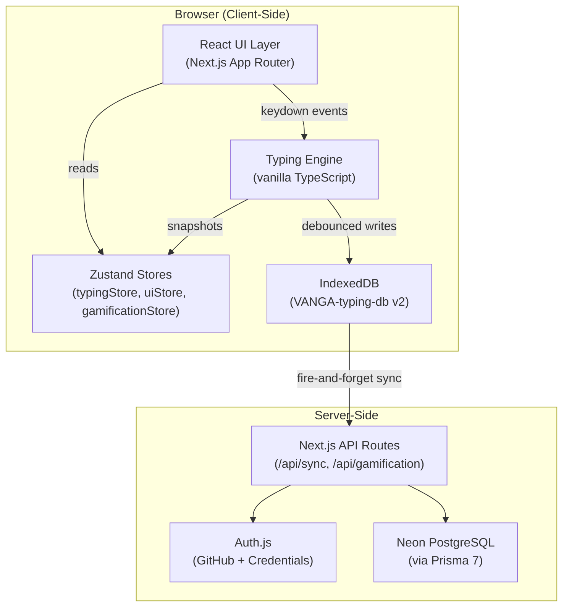

# VangaTypePanalam — Full Project Walkthrough

> **வாகை டைப் பணாலம்** — A free, adaptive, offline-first typing tutor for English, Tamil & Tanglish.

---

## What Is This Project?

VangaTypePanalam is an **adaptive typing practice web application** inspired by [Keybr](https://keybr.com) and [Monkeytype](https://monkeytype.com). It teaches touch typing from scratch using a 30-lesson progressive curriculum, tracks per-key performance with circular-buffer analytics, and generates practice text that targets the user's weakest keys.

The app supports **three languages**: English (QWERTY), Tamil (Tamil99 layout), and Tanglish (romanized Tamil). All core logic runs entirely client-side for zero-latency typing, with an optional cloud sync layer for cross-device backup.

---

## Tech Stack

| Layer | Technology | Purpose |
|---|---|---|
| Framework | **Next.js 16** (App Router, React 19) | SSR, routing, API routes |
| Auth | **Auth.js** (NextAuth v5 beta) | GitHub OAuth + email/password |
| Cloud DB | **Neon PostgreSQL** + **Prisma 7** | Cloud backup storage, Gamification DB |
| Local DB | **IndexedDB** via `idb` | Offline-first data persistence |
| State | **Zustand** (v5) | Reactive UI state management |
| Styling | **Vanilla CSS** (custom properties) | Design tokens, theming |
| Icons | **Lucide React** | Consistent iconography |
| Fonts | Inter + Noto Sans Tamil + JetBrains Mono | Typography |

---

## Architecture Overview



### Design Principles

1. **Offline-First Hybrid** — All typing logic and data lives in IndexedDB. Cloud sync is optional and non-blocking.
2. **Zero-Polling Engine** — No `setInterval` or `requestAnimationFrame` loops for typing core. Metrics are calculated only on keystrokes.
3. **Event-Driven Updates** — The `SessionTracker` emits snapshots to Zustand only when keystrokes occur. React renders surgically from store changes.
4. **Under 16ms Latency** — DOM updates use CSS class toggles, not React re-renders. The engine is decoupled from React entirely.
5. **Dynamic Gamification** — Ranks, badges, and challenges are fetched from the cloud but fallback to local constants for offline use.

---

## Project Structure

```
VaagaTypePanalam/
├── src/
│   ├── app/                          # Next.js App Router
│   │   ├── page.tsx                  # Practice mode (home route: /)
│   │   ├── admin/                    # Admin Central Dashboard
│   │   ├── stats/                    # LeetCode-style profile dashboard
│   │   ├── api/                      # API routes (auth, sync, gamification, admin)
│   │   ├── lessons/                  # Lesson system
│   │   ├── test/                     # Timed test mode
│   │   └── race/                     # Ghost race mode
│   │
│   ├── engine/                       # 🧠 Core Logic (pure TypeScript)
│   │   ├── sessionTracker.ts         # State machine
│   │   ├── keyProfiler.ts            # Per-key analytics
│   │   ├── gamification.ts           # Rank & Badge calculations
│   │   └── textGenerator.ts          # Adaptive text generation
│   │
│   ├── components/
│   │   ├── typing/                   # TypingArea and metrics
│   │   ├── keyboard/                 # VirtualKeyboard heatmap
│   │   ├── profile/                  # MasteryDonut, BadgeCard, SeasonChallenge
│   │   └── ui/                       # TopHeader, Sidebars, Modals
│   │
│   ├── db/                           # IndexedDB layer
│   ├── store/                        # Zustand stores (typing, ui, gamification)
│   ├── data/                         # Static lessons & keyboard layouts
│   └── lib/                          # Sync utilities, Prisma client
│
└── docs/                             # Documentation Center
    ├── ARCHITECTURE.md
    ├── API.md
    ├── ROADMAP.md
    ├── CHANGELOG.md
    └── walkthough.md
```

---

## Core Systems Deep Dive

### 1. The Typing Engine (`src/engine/`)

The engine is **pure TypeScript with zero React dependencies** — designed for raw speed.

#### SessionTracker — The State Machine
- States: `idle` → `ready` → `typing` → `finished`
- On every keystroke: compares typed char vs expected, records latency, passes to `KeyProfiler`, emits a `SessionSnapshot`
- **Practice mode**: Endless — when text is exhausted, `finishSegment()` silently saves the session, generates fresh text, and continues with cumulative stats preserved.

#### KeyProfiler — Adaptive Learning Core
- Each key (`a`, `க`, etc.) has a profile with:
  - `CircularBuffer<boolean>(50)` for recent correct/error results.
  - `CircularBuffer<number>(20)` for recent latencies.
- **Confidence score** = accuracy (60%) + speed (40%), where speed is normalized between 200ms (best) and 1500ms (worst).
- Keys with confidence < 0.6 are flagged as **weak**.

#### Gamification Engine (`gamification.ts`)
- **Rank System**: 6 tiers from Beginner to Master based on average WPM.
- **Badge System**: 15+ unlockable badges with rarity levels (Common to Legendary).
- **Season Challenges**: Monthly rotating targets (e.g., "Speed Month" for 60 WPM).
- **XP System**: 1 XP earned per correct character typed.

### 2. The UI Layer (`src/components/`)

#### Profile Dashboard (`/stats`)
- **LeetCode-Inspired**: 2-column layout with a sticky profile card on the left.
- **Mastery Donut**: SVG chart showing distribution of Mastered, Learning, and Weak keys.
- **Activity Heatmap**: GitHub-style grid tracking daily practice consistency.
- **Interactive Badges**: 3D-flip cards that reveal motivational quotes and detailed stats.

#### TypingArea — High-Performance Interface
- **Word-based rendering**: Surgical DOM updates via CSS class toggles.
- **Line scrolling**: Active word is kept on the 2nd visible line via `translateY` transforms.
- **Input handling**: Dual-path — `onKeyDown` for desktop, hidden `<input>` for mobile/IME.

### 3. Data & Storage

#### IndexedDB (`src/db/`)
Database: `VANGA-typing-db` (version 2) with stores for `user-profile`, `key-stats`, `sessions`, `lesson-progress`, `sync-queue`, and `word-cache`.

#### Cloud Sync (`src/lib/sync.ts`)
- Fire-and-forget background synchronization.
- Mirrors local IDB state to Neon PostgreSQL via `/api/sync`.
- Triggered automatically on session completion if the user is authenticated.

---

## Version History (Highlights)

| Version | Date | Key Features |
|---|---|---|
| **0.5.0** | 2026-05-01 | **Admin Dashboard**, Dynamic Gamification, 3D Badge Flips, Offline Toggle |
| **0.4.0** | 2026-04-25 | **Redesigned Profile**, Season Challenges, Mastery Donut, SVG Badge Assets |
| **0.3.0** | 2026-04-19 | **Cloud Sync**, Auth.js Integration, Prisma 7, Global Rename |
| **0.2.0** | 2026-04-13 | **Calibration Engine**, Error Highlighting, Docs Center |
| **0.1.0** | 2026-04-12 | Initial Release — Core Engine, 3 Languages, 30 Lessons |

---

*Built with ❤️ for the typing community*
