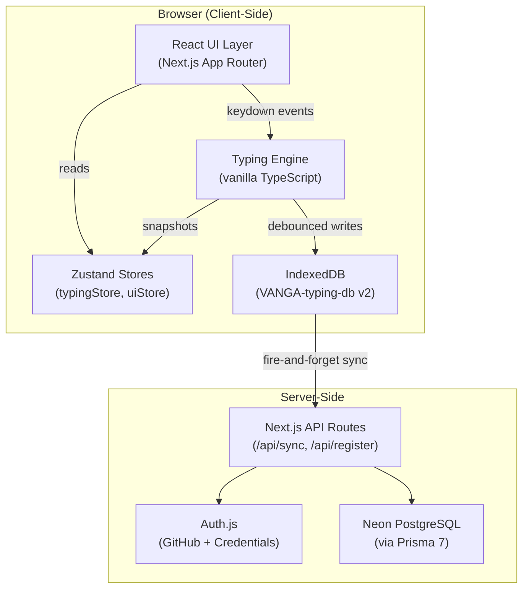
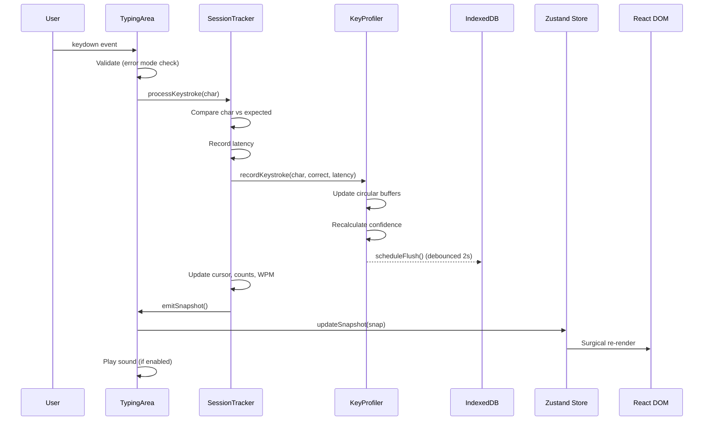

# VangaTypePanalam — Full Project Walkthrough

> **வாகை டைப் பணாலம்** — A free, adaptive, offline-first typing tutor for English, Tamil & Tanglish.

---

## What Is This Project?

VangaTypePanalam is an **adaptive typing practice web application** inspired by [Keybr](https://keybr.com) and [Monkeytype](https://monkeytype.com). It teaches touch typing from scratch using a 30-lesson progressive curriculum, tracks per-key performance with circular-buffer analytics, and generates practice text that targets the user's weakest keys.

The app supports **three languages**: English (QWERTY), Tamil (Tamil99 layout), and Tanglish (romanized Tamil). All core logic runs entirely client-side for zero-latency typing, with an optional cloud sync layer for cross-device backup.

---

## Tech Stack

| Layer | Technology | Purpose |
|---|---|---|
| Framework | **Next.js 16** (App Router, React 19) | SSR, routing, API routes |
| Auth | **Auth.js** (NextAuth v5 beta) | GitHub OAuth + email/password |
| Cloud DB | **Neon PostgreSQL** + **Prisma 7** | Cloud backup storage |
| Local DB | **IndexedDB** via `idb` | Offline-first data persistence |
| State | **Zustand** (v5) | Reactive UI state management |
| Styling | **Vanilla CSS** (custom properties) | Design tokens, theming |
| Icons | **Lucide React** | Consistent iconography |
| Fonts | Inter + Noto Sans Tamil + JetBrains Mono | Typography |

---

## Architecture Overview



### Design Principles

1. **Offline-First Hybrid** — All typing logic and data lives in IndexedDB. Cloud sync is optional and non-blocking.
2. **Zero-Polling Engine** — No `setInterval` or `requestAnimationFrame` loops for typing core. Metrics are calculated only on keystrokes.
3. **Event-Driven Updates** — The `SessionTracker` emits snapshots to Zustand only when keystrokes occur. React renders surgically from store changes.
4. **Under 16ms Latency** — DOM updates use CSS class toggles, not React re-renders. The engine is decoupled from React entirely.

---

## Project Structure

```
VaagaTypePanalam/
├── src/
│   ├── app/                          # Next.js App Router
│   │   ├── page.tsx                  # Practice mode (home route: /)
│   │   ├── layout.tsx                # Root layout (fonts, theme, TopHeader, Footer)
│   │   ├── globals.css               # Design tokens & base styles
│   │   ├── lessons/                  # Lesson system
│   │   │   ├── page.tsx              # Lesson list
│   │   │   └── [id]/page.tsx         # Individual lesson page
│   │   ├── test/page.tsx             # Timed test mode (15/30/60/120s)
│   │   ├── race/page.tsx             # Ghost race mode
│   │   ├── stats/page.tsx            # Statistics dashboard
│   │   ├── practice/                 # Practice sub-routes
│   │   └── api/                      # API routes
│   │       ├── auth/[...nextauth]/   # Auth.js handler
│   │       ├── sync/route.ts         # Cloud sync push/pull
│   │       └── register/route.ts     # Email/password registration
│   │
│   ├── engine/                       # 🧠 Typing Engine (pure TypeScript)
│   │   ├── sessionTracker.ts         # State machine (idle→ready→typing→finished)
│   │   ├── keyProfiler.ts            # Per-key circular buffer analytics
│   │   ├── textGenerator.ts          # Adaptive text generation (sync)
│   │   ├── textGeneratorAsync.ts     # Async variant with word cache
│   │   ├── statsCalculator.ts        # WPM, accuracy, consistency math
│   │   ├── soundEngine.ts            # Web Audio API click/error sounds
│   │   ├── constants.ts              # All tuning parameters
│   │   └── index.ts                  # Public API barrel export
│   │
│   ├── components/
│   │   ├── typing/TypingArea.tsx      # Core typing interface (675 lines)
│   │   ├── keyboard/VirtualKeyboard.tsx # On-screen keyboard with heatmap
│   │   ├── ui/
│   │   │   ├── TopHeader.tsx          # Nav bar + settings dropdown + auth
│   │   │   ├── LeftSidebar.tsx        # Daily progress, streaks
│   │   │   ├── RightSidebar.tsx       # Live analytics
│   │   │   ├── AuthModal.tsx          # Sign-in/sign-up modal
│   │   │   └── Footer.tsx            # Page footer
│   │   └── providers/AuthProvider.tsx # Auth.js session wrapper
│   │
│   ├── data/                         # Static definitions
│   │   ├── lessons/                  # Lesson curricula (english.ts, tamil.ts, tanglish.ts)
│   │   ├── keyboards/               # Layout data (qwerty.ts, tamil99.ts)
│   │   └── wordBanks/               # Word pools per language
│   │
│   ├── db/                           # IndexedDB layer
│   │   ├── index.ts                  # Singleton DB connection
│   │   ├── schema.ts                 # TypeScript interfaces + DBSchema
│   │   ├── profile.ts                # User profile CRUD
│   │   ├── keyStats.ts               # Per-key statistics CRUD
│   │   ├── sessions.ts               # Session history CRUD
│   │   ├── lessonProgress.ts         # Lesson unlock/progress CRUD
│   │   └── wordCache.ts             # Lazy word bank cache (30-day TTL)
│   │
│   ├── store/                        # Zustand stores
│   │   ├── typingStore.ts            # Session snapshot (reactive mirror of engine)
│   │   └── uiStore.ts               # Theme, language, sound, caret, modals
│   │
│   ├── lib/
│   │   ├── prisma.ts                 # Prisma client singleton
│   │   └── sync.ts                   # Cloud sync utility (push/pull)
│   │
│   ├── styles/
│   │   ├── typing.css                # Typing area visuals
│   │   └── keyboard.css              # Virtual keyboard styles
│   │
│   └── auth.ts                       # Auth.js configuration
│
├── prisma/schema.prisma              # Cloud DB schema (User, Account, CloudBackup)
├── public/data/words-en.json         # Large word bank (loaded lazily)
└── docs/                             # Project documentation
    ├── ARCHITECTURE.md
    ├── CHANGELOG.md
    ├── DEPLOYMENT.md
    └── CHECKLIST.md
```

---

## Core Systems Deep Dive

### 1. The Typing Engine (`src/engine/`)

The engine is **pure TypeScript with zero React dependencies** — designed for raw speed.

#### SessionTracker — The State Machine
- States: `idle` → `ready` → `typing` → `finished`
- On every keystroke: compares typed char vs expected, records latency, passes to `KeyProfiler`, emits a `SessionSnapshot`
- **Practice mode**: Endless — when text is exhausted, `finishSegment()` silently saves the session, generates fresh text, and continues with cumulative stats preserved
- **Lesson mode**: Finishes at end of text, records attempt, evaluates against target WPM/accuracy
- **Test mode**: Like practice but finishes on external timer signal via `forceFinish()`

#### KeyProfiler — Adaptive Learning Core
- Each key (`a`, `க`, etc.) has a profile with:
  - `CircularBuffer<boolean>(50)` for recent correct/error results
  - `CircularBuffer<number>(20)` for recent latencies
- **Confidence score** = accuracy (60%) + speed (40%), where speed is normalized between 200ms (best) and 1500ms (worst)
- Keys with confidence < 0.6 are flagged as **weak**
- Also tracks **digraphs** (two-char sequences) for identifying slow transitions
- IDB writes are **debounced at 2-second intervals** to avoid write storms

#### TextGenerator — Weighted Word Selection
- Builds a weighted pool: weak keys get **3×** weight, unpracticed **2×**, mastered **1×**
- Uses `weightedRandomSelect()` to pick a target key, then pulls words from the word bank containing that key
- For digraph optimization: scores candidate words by how many weak digraphs they contain
- The async variant (`textGeneratorAsync.ts`) uses the lazy `WordCache` for large word banks

#### SoundEngine — Web Audio API
- Procedural sounds (no audio files): oscillator + gain nodes
- `playKeystroke()` for correct input, `playError()` for mistakes
- Toggle controlled by `uiStore.soundEnabled`

### 2. The UI Layer (`src/components/`)

#### TypingArea (675 lines) — The Heart of the UI
- **Word-based rendering**: Text is split into words, each word into letters with CSS classes (`correct`, `error`, `extra`, `current`, `upcoming`)
- **Smooth caret**: Positioned via `offsetLeft`/`offsetTop` calculations, animated with CSS transitions at configurable speed
- **Line scrolling**: Active word is kept on the 2nd visible line via `translateY` transforms
- **Input handling**: Dual-path — `onKeyDown` for desktop, hidden `<input>` with `onInput` for mobile/IME
- **Error modes**: `free` (advance always), `stopOnWord` (can't skip incorrect words), `stopOnLetter` (must type exact match)
- **Results overlay**: Shows WPM, accuracy, consistency, errors, raw WPM, and slowest digraphs on completion

#### VirtualKeyboard (200 lines)
- Renders full keyboard from layout data (`qwerty.ts` or `tamil99.ts`)
- **Finger color coding**: Each key colored by assigned finger (pinky through thumb)
- **Heatmap overlay**: Keys colored by accuracy — red for low accuracy, gold for high mastery
- **Next-key highlighting**: Shows which key to press next
- **Press feedback**: Visual flash on correct/error keystroke

#### TopHeader (769 lines)
- Fixed top nav with centered navigation pill (Practice, Test, Race, Lessons, Stats)
- Right-side controls: online/offline status, language selector, theme toggle, settings dropdown
- Settings dropdown contains: sound toggle, keyboard visibility, caret style/speed, auth section
- **Cloud sync trigger**: Runs `requestCloudSync()` when authenticated session is detected

### 3. Data & Storage

#### IndexedDB (`src/db/`)
Database: `VANGA-typing-db` (version 2) with 6 object stores:

| Store | Key | Purpose |
|---|---|---|
| `user-profile` | `id` (string) | Settings, streaks, daily activity, best WPM |
| `key-stats` | `char` (string) | Per-key confidence, latencies, accuracy |
| `sessions` | `id` (UUID) | Full session logs with keystroke records |
| `lesson-progress` | `lessonId` | Completion, best scores, attempts per lesson |
| `sync-queue` | auto-increment | Queued items for cloud sync |
| `word-cache` | `language` | Cached word banks with 30-day TTL |

#### Prisma / PostgreSQL (`prisma/schema.prisma`)
Cloud-side models:
- `User`, `Account`, `Session`, `VerificationToken` — Auth.js standard
- `CloudBackup` — Serialized JSON blobs of IDB stores (stats, sessions, profile)

### 4. State Management (`src/store/`)

Two Zustand stores:

- **`typingStore`**: Mirrors the engine's `SessionSnapshot` — text, cursor position, WPM, accuracy, word-level state, burst history, consistency. Updated only on keystrokes.
- **`uiStore`**: Persisted to `localStorage` — theme, language, keyboard layout, sound, caret style/speed, error mode, modals, online status. Uses `zustand/persist` with selective partializing.

### 5. Lesson System (`src/data/lessons/`)

- **30 progressive levels** per language
- English starts with `f` + `j` (home keys) and builds up to full keyboard
- Tamil starts with basic vowels (அ, ஆ, இ, ஈ) and progresses through consonants
- Each lesson defines: `id`, `level`, `title`, `description`, `keys[]`, `targetWpm`, `targetAccuracy`
- The lesson page shows: finger position guide (SVG), Tamil99 key hints, uyirmei combination chart
- **Progression**: Must meet `targetWpm` AND `targetAccuracy` to unlock "Next Lesson" button

---

## Data Flow: What Happens When You Press a Key



---

## Modes of Operation

| Mode | Route | Behavior |
|---|---|---|
| **Practice** | `/` | Endless flow. Regenerates text targeting weak keys. Segments auto-chain silently. |
| **Timed Test** | `/test` | Hard cutoff at 15/30/60/120s. Shows countdown ring + final scorecard. |
| **Lessons** | `/lessons/[id]` | Structured progression. Must meet WPM + accuracy targets. Star ratings. |
| **Race** | `/race` | Ghost race mode with lane visualization. |
| **Stats** | `/stats` | Session history, per-key heatmap, daily activity calendar. |

---

## Key Configuration Constants

| Constant | Value | Meaning |
|---|---|---|
| `ACCURACY_WEIGHT` | 0.6 | 60% of confidence score comes from accuracy |
| `SPEED_WEIGHT` | 0.4 | 40% from speed |
| `WEAK_KEY_THRESHOLD` | 0.6 | Keys below this confidence are "weak" |
| `WEAK_KEY_WEIGHT` | 3× | Weak keys appear 3× more often in generated text |
| `IDB_FLUSH_DEBOUNCE_MS` | 2000ms | Batch IDB writes every 2 seconds |
| `IDLE_TIMEOUT_MS` | 5000ms | Ignore latencies > 5s (user was idle) |
| `MIN_SESSION_CHARS` | 10 | Minimum chars to save a session |
| `PRACTICE_SEGMENT_LENGTH` | 90 chars | Length of each endless practice chunk |

---

## Cloud Sync Flow

1. User signs in via GitHub OAuth or email/password (Auth.js)
2. On session detection, `TopHeader` calls `requestCloudSync()`
3. `sync.ts` collects all local IDB data (stats, sessions, profile)
4. POSTs serialized JSON to `/api/sync`
5. Server writes to `CloudBackup` model in Neon PostgreSQL
6. Sync is **fire-and-forget** — zero impact on typing latency
7. `restoreFromCloud()` exists but bulk restore is still TODO

---

## Current Status & Roadmap

### Phase 1 ✅ Complete
- Adaptive typing engine with circular buffer analytics
- 3 language support (English, Tamil, Tanglish)
- 30-level lesson system with star ratings
- Stats dashboard with session history
- Virtual keyboard with finger guides + heatmap
- Offline-first with IndexedDB
- GitHub OAuth + cloud backup

### Phase 2 (In Progress / Planned)
- [x] Multiplayer typing races (Socket.IO ready)
- [x] Server-side sync & cloud backup
- [ ] Sound effects expansion (Keybr-style toggle)
- [ ] Service Worker with Serwist (full PWA)
- [ ] Additional keyboard layouts (Inscript, Typewriter)
- [ ] Bulk cloud restore on new device login

---

## Version History (Latest)

| Version | Date | Highlights |
|---|---|---|
| **0.3.3** | 2026-04-22 | Tamil99 backspace fix, keyboard data ergonomics, `KEY_DATA_BY_KEY` maps |
| **0.3.2** | 2026-04-20 | Nav restructure, theme response, GPLv3 license, CONTRIBUTING.md |
| **0.3.1** | 2026-04-20 | Monkeytype-style nav redesign, settings dropdown, slimmer header |
| **0.3.0** | 2026-04-19 | Auth.js integration, cloud sync, Prisma 7, global rename |
| **0.2.1** | 2026-04-15 | Calibration display fix, timer cleanup, idle metrics optimization |
| **0.2.0** | 2026-04-13 | Calibration engine, error highlighting, docs center, high-speed input fix |
| **0.1.0** | 2026-04-12 | Initial release — core engine, 3 languages, 30 lessons, offline storage |
